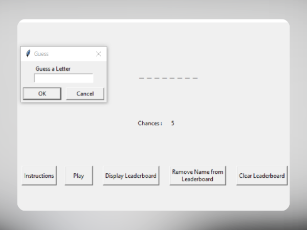

# Guess the Word Game



Welcome to the Guess the Word Game! This is an interactive word-guessing game built using Python and TKinter for the graphical user interface. Each time you play, a new word is randomly selected from the dictionary, and you'll have to guess the word by suggesting letters. But be careful, you have only 5 chances to guess a wrong letter before the game is over!

## How to Play

1. **Run the Application:** To start playing, run the `Game.py` file. The game window will open, displaying the current word with blank spaces for the letters.

2. **Game Rules:** The objective of the game is to guess the correct word by suggesting individual letters. You have to guess all the letters in the word before running out of chances.

3. **Guess a Letter:** Type a letter in the input field and click the "Guess" button to suggest that letter. If the letter exists in the word, it will replace the blank spaces in the appropriate positions. Otherwise, you'll lose a chance.

4. **Remaining Chances:** The number of remaining chances is displayed on the screen. You have only 5 chances to guess a wrong letter.

5. **Score and Leaderboard:** If you successfully guess the word, your score will be added to the leaderboard.
  
6. **Play Again:** After the game ends, you can choose to play another round. Click the "Play Again" button to start a new game with a new word.

## Database Schema

The leaderboard table should have the following schema:

```
CREATE TABLE leaderboard (
    name VARCHAR(50) NOT NULL,
    score INT NOT NULL
);
```

---

Have fun playing the Guess the Word Game and test your word-guessing skills! If you encounter any issues or have suggestions for improvement, feel free to reach out. Enjoy the game!
